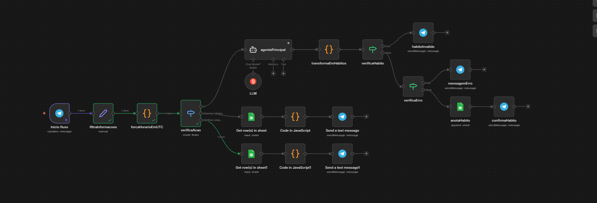

# HabitTracker

Sistema automatizado para registro e acompanhamento de hábitos via Telegram, com IA para interpretar mensagens em linguagem natural.

---

## 📌 Problema

Registrar hábitos manualmente é chato e inconsistente. As pessoas esquecem, perdem o controle e abandonam o processo.

---

## 🚀 Solução

O usuário manda uma mensagem informal no Telegram como _"estudei 2h de n8n"_ e o sistema automaticamente interpreta, categoriza e registra o hábito — sem formulários, sem apps extras.

---

## ⚙️ Tecnologias

- n8n (automação de fluxos)
- Groq (LLM para interpretação de linguagem natural)
- Google Sheets (armazenamento de dados)
- Telegram Bot API (interface de entrada)

---

## 🔧 Funcionalidades

- Registro de hábitos via mensagem informal em linguagem natural
- Interpretação e categorização automática com IA
- Validação se a mensagem é realmente um hábito
- Tratamento de erros com feedback ao usuário
- Consulta de hábitos do dia com `/meus_habitos`
- Verificação de sequência de dias consecutivos com `/streak`

---

## 🧠 Como funciona

1. Usuário envia mensagem informal (ex: "corri 30 minutos hoje")
2. A IA interpreta e extrai: hábito, categoria, duração e data/hora
3. O sistema valida se é realmente um hábito
4. Os dados são registrados automaticamente no Google Sheets
5. O usuário recebe confirmação instantânea

---

## 💬 Comandos disponíveis

| Comando         | Descrição                                               |
| --------------- | ------------------------------------------------------- |
| Mensagem livre  | Registra um hábito automaticamente                      |
| `/meus_habitos` | Lista os hábitos registrados hoje                       |
| `/streak`       | Mostra quantos dias consecutivos você registrou hábitos |

---

## 📂 Como usar

1. Importar o arquivo JSON no n8n
2. Configurar credenciais (Telegram, Groq e Google Sheets)
3. Criar uma planilha no Google Sheets com as colunas: `chat_id`, `Data`, `Hora`, `Hábito`, `Categoria`, `Duração`, `Mensagem Original`
4. Ativar o workflow

---

## 💡 Possíveis aplicações futuras

- Tracking pessoal de hábitos
- Acompanhamento de rotina
- Relatórios de produtividade
- Base para sistemas de gamificação de hábitos

---
